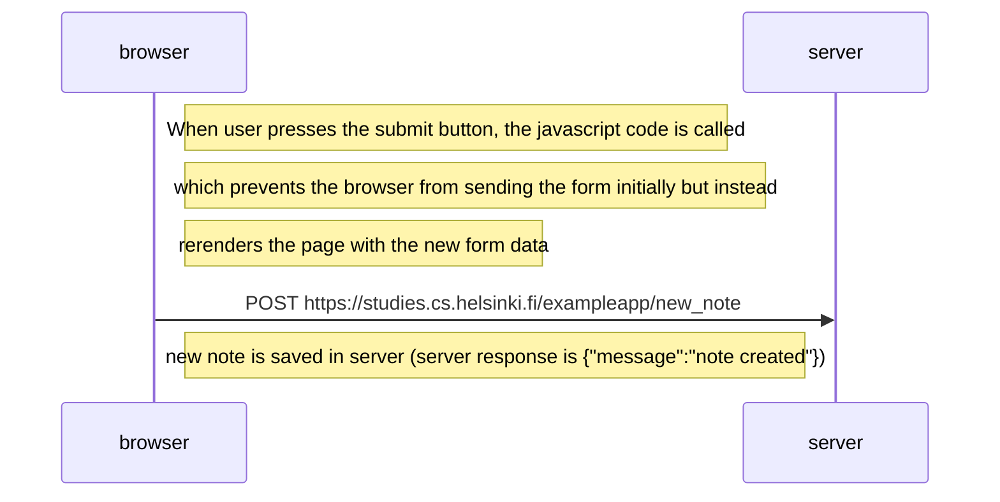

```mermaid
sequenceDiagram
    participant browser
    participant server

Note right of browser: When user presses the submit button, the javascript code is called
Note right of browser: which prevents the browser from sending the form initially but instead 
Note right of browser: rerenders the page with the new form data

    browser->>server: POST https://studies.cs.helsinki.fi/exampleapp/new_note
    activate server
Note right of browser: new note is saved in server (server response is {"message":"note created"})

```
